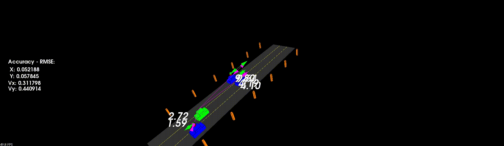

# Unscented Kalman Filter

## Overview
The project uses sensor information from LiDAR and RADAR and predicts the position and velocities of vehicles around the ego vehicle, replicating the highway driving scenario. The project uses Unscented Kalman Filter for prediction and sensor fusion.

## Pipeline
 The implementaion assumes a CTRV motion model.
1. Based on the sensor type, a message is created containing sensor information. This information is stored in the state vector. If the information is coming from LiDAR, the position measurementsa are stored in the state vector. If the information is coming from RADAR, the measurements are converted from Polar to Cartesian coordinates and stored in the state vector.
2. Prediction step : In the Prediction step, the state and covariance are extended to an augmented state where noise vector is added to the state vector. Further, sigma points are generated which represent the Gaussian disttibution. These sigma points are processed through the model and the resultants are used in calculating the predicted mean and covariance.
3. Measurement step : In the Measurement Step, processing is carried out based on whether the incoming sensor measurement is coming from the RADAR or the LiDAR. The same sigma points from the Prediction step are used to obtain the inscented measurement model mean and covariance.
4. Loop closure : Kalman Gain is calculated based on a cross-correlation matrix between the prediction and measurement covariances and the loop is closed by updating the state ean anad covariance using the Kalman weight factor.

## Build and Run
`git clone https://github.com/Ytodi31/Unscented_Kalman_Filter`\
`mkdir build` \
`cd build` \
`cmake ..` \
`make` \
`./ukf_highway`

## Results
- The output of the Unscented Kalman FIlter is shown in the video. The accuracy of the implemented Unscented Kalman Filter is calculated using Root Mean Square Error between the estimation and ground truth. It can be observed that the RMSE values are low and seem to converge to zero with increasing measurements.
- The estimations using LiDAR measurements are shown in green and the estimations using RADAR measurements are shown in purple. The magnitude of these estimations are displayed in the output and the direction is shown by arrows.
- It is observed that the RMSE values increase if measurements are taken from only one sensor, and the RMSE values converge faster is sensor fusion is done with LiDAR and RADAR measurements.
